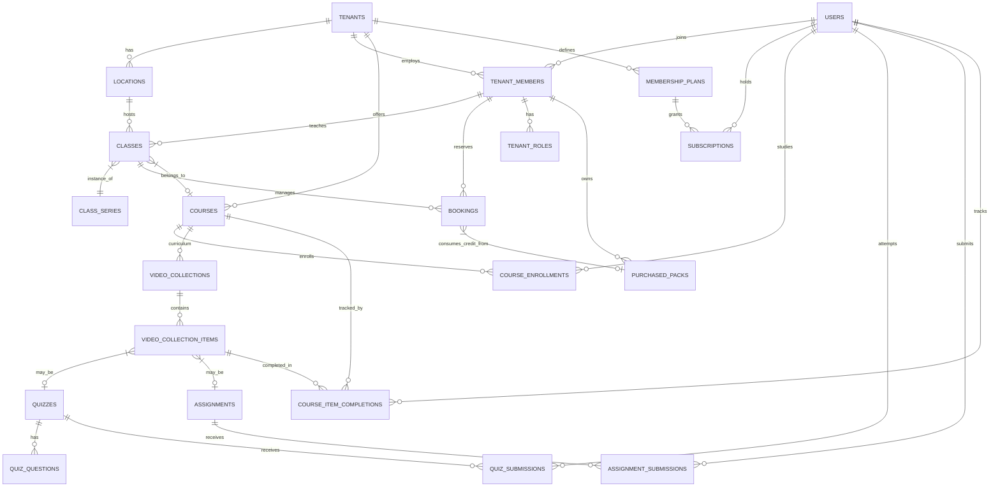
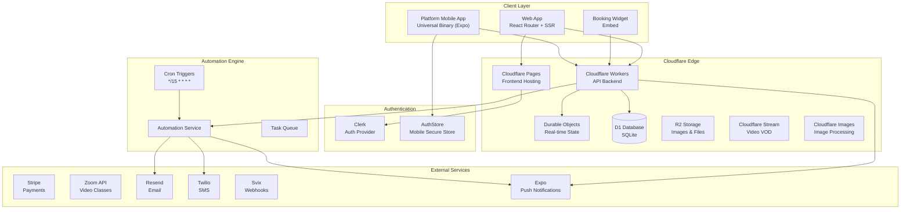
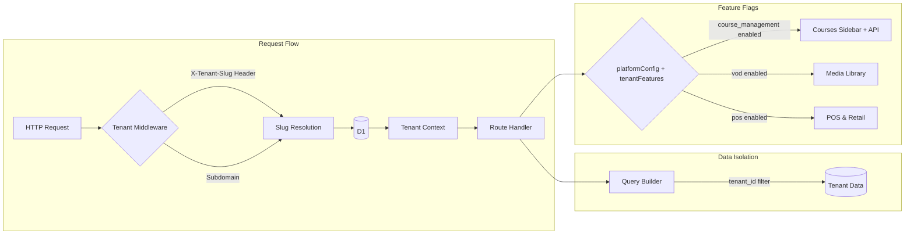

# Studio Platform

The modern, all-in-one platform for dance, yoga, and fitness studios.

## Features

*   **Studio Management:** Class scheduling, member management, and point-of-sale.
*   **Memberships & Subscriptions:** Self-service membership plans with Stripe billing, free trials, archive/restore lifecycle, and student-facing plan browser. Students can cancel subscriptions directly from their profile.
*   **Course Management (LMS):** Hybrid courses combining live sessions, on-demand VOD, quizzes, assignments, and per-lesson completion tracking with progress percentage. Instructors can grade assignments with feedback.
*   **Student Portal:** Full self-service portal at `/portal/:slug` — book classes, view attendance history, manage class pack credits, browse and enroll in courses, manage memberships, and edit their profile (name, phone).
*   **RBAC & Security:** Comprehensive role-based access control audited across 92+ API routes. Students are precisely scoped to their own data with explicit IDOR guards on tag assignments, custom field values, and booking records.
*   **Website Builder:** Drag-and-drop website editor with custom domains.
*   **Student App:** Mobile app for students to book classes and manage their accounts.
*   **Automations:** Powerful email and SMS marketing automations with trigger events (Birthday, Absent, Trial Ending, Membership Dunning, etc).
*   **QR Codes:** Generate tracking-ready QR codes for check-in, app downloads, and marketing.
*   **High Performance Edge:** Sub-50ms latency for core operations via Cloudflare Workers and D1 batching.

## Database Schema (3NF)

The platform follows a multi-tenant 3NF (Third Normal Form) database design optimized for Cloudflare D1. Full annotated schema: [`docs/schema_diagram.md`](docs/schema_diagram.md).




## Architecture

### System Overview



### Multi-Tenant Architecture



## Software Packages

This monorepo handles multiple applications and packages. Here are the primary technologies and libraries used:

### Apps

#### **Web (`apps/web`)**
*   **Framework:** `react-router` v7, `react` v19
*   **Platform:** Cloudflare Pages
*   **Styling:** `tailwindcss` v4, `lucide-react`
*   **State & Data:** `@tanstack/react-query`
*   **Auth:** `@clerk/react-router`
*   **Real-time:** `livekit-client`
*   **Editor:** `@tiptap/react`, `@puckeditor/core`
*   **Charts:** `recharts`
*   **Payments:** `@stripe/react-stripe-js`

#### **Mobile (`apps/mobile`)**
*   **Framework:** `expo` v54, `react-native`
*   **Routing:** `expo-router`
*   **Styling:** `nativewind` v4, `tailwindcss`
*   **Auth:** `expo-secure-store`
*   **UI:** `@react-navigation/native`, `react-native-reanimated`

### Packages

#### **API (`packages/api`)**
*   **Framework:** `hono` (Edge optimized)
*   **Runtime:** Cloudflare Workers
*   **Validation:** `zod`, `@hono/zod-openapi`
*   **Database:** `drizzle-orm`, `@studio/db`
*   **External Services:** `stripe`, `resend`, `twilio`, `livekit-server-sdk`, `svix`
*   **Utilities:** `jspdf`, `papaparse`

#### **Database (`packages/db`)**
*   **ORM:** `drizzle-orm`
*   **Migration:** `drizzle-kit`
*   **Driver:** `@libsql/client` (Remote/Local SQLite)
*   **Seeding:** `@faker-js/faker`

#### **Emails (`packages/emails`)**
*   **Framework:** `react-email`
*   **Components:** `@react-email/components`

#### **UI (`packages/ui`)**
*   **Type:** Shared React Component Library
*   **Dependencies:** `react`, `nativewind`

## Development

### Prerequisites

*   Node.js 18+
*   NPM
*   Cloudflare Wrangler

### Getting Started

1.  **Install Dependencies:**
    ```bash
    npm install
    ```

2.  **Run Development Server:**
    ```bash
    npm run dev
    ```

3.  **Deploy Web App:**
    ```bash
    npm run deploy -w web
    ```

## Disaster Recovery

The platform includes automated daily database backups:
- **Schedule:** Daily at 2 AM UTC
- **Storage:** Cloudflare R2 (90-day retention)
- **Recovery:** See [docs/disaster-recovery.md](docs/disaster-recovery.md)

## Architecture Details

See [docs/architecture.md](docs/architecture.md) for deeper dives into security, RBAC, and optimization strategies.
