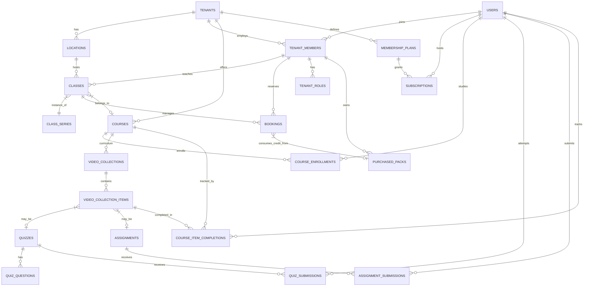
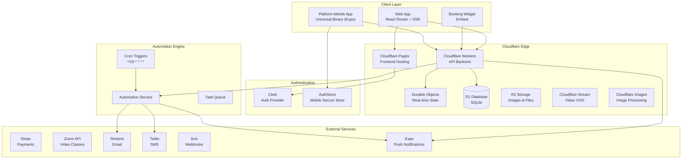
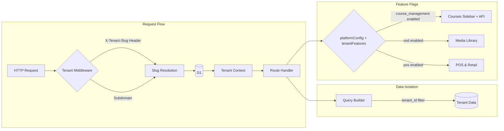

# Studio Platform

The modern, all-in-one platform for dance, yoga, and fitness studios.

## Features

*   **Studio Management:** Class scheduling, member management, point-of-sale (with automatic sales tax, rich transaction metadata, and robust refund tracking), and Kiosk Mode with walk-in booking support. POS now supports seamless membership sign-ups and auto-account creation for new customers.
*   **Memberships & Subscriptions:** Self-service membership plans with Stripe billing, free trials, archive/restore lifecycle, and student-facing plan browser. Includes support for **Time-Limited Memberships** (e.g., fixed-duration passes that do not auto-renew) and seamless integration with the Stripe Billing Portal for updating payment methods. Students can cancel subscriptions directly from their profile.
*   **Brand & Customization:** Includes a custom Card Creator engine enabling studios to generate and auto-export dynamic gradient backgrounds with multi-line typography alignments tailored for class packs and membership previews.
*   **Course Management (LMS):** Hybrid courses combining live sessions, on-demand VOD, quizzes, assignments, and per-lesson completion tracking with progress percentage. Instructors can grade assignments with feedback.
*   **Student Portal:** Full self-service portal at `/portal/:slug` — book classes, join waitlists, view attendance history, manage class pack credits, browse and enroll in courses, manage memberships, and edit their profile (name, phone).
*   **RBAC & Security:** Comprehensive role-based access control audited across 92+ API routes. Students are precisely scoped to their own data with explicit IDOR guards on tag assignments, custom field values, and booking records.
*   **Website Builder:** Drag-and-drop website editor with custom domains.
*   **Public Instructor Profiles:** Shareable instructor pages with detailed schedules and approved student reviews.
*   **Student App:** Mobile app for students to book classes and manage their accounts.
*   **Automations & Email Marketing:** Powerful email and SMS marketing automations with trigger events (Waitlist Promoted, Pack Credits Low, Birthday, Absent, Trial Ending). Full multi-tenant Email Marketing system allowing studios to attach custom domains, sync newsletter audiences, and send HTML broadcasts.
*   **Analytics Dashboards:** Comprehensive reporting with churn-risk modeling, revenue breakdown (subscriptions vs packs vs POS), and automation effectiveness tracking. Includes **Automated Billing Sync** with immediate Stripe invoice finalization and email receipts for tenant owners.
*   **SEO Management:** Automated multi-tenant localized SEO via edge-rendered HTMLRewriter, streaming D1 sitemaps, and dynamic Schema.org injection. Includes Google Business Profile OAuth sync, real-time Google Indexing API integration, and **AI-Powered Local Blogging** via Gemini AI. Now features **Strategic Strategy Guidance**, **Competitive Search Ranking**, **Automated Student Push Notifications**, and **Usage/Cost Tracking** across all AI features.
*   **QR Codes:** Generate tracking-ready QR codes for check-in, app downloads, and marketing.
*   **High Performance Edge:** Sub-50ms latency for core operations via Cloudflare Workers and D1 batching.

## Database Schema (3NF)

The platform follows a multi-tenant 3NF (Third Normal Form) database design optimized for Cloudflare D1. Full annotated schema: [`docs/schema_diagram.md`](docs/schema_diagram.md).


```mermaid
erDiagram
    TENANTS ||--o{ LOCATIONS : has
    TENANTS ||--o{ TENANT_MEMBERS : employs
    TENANTS ||--o{ COURSES : offers
    TENANTS ||--o{ MEMBERSHIP_PLANS : defines

    USERS ||--o{ TENANT_MEMBERS : joins
    USERS ||--o{ SUBSCRIPTIONS : holds
    USERS ||--o{ COURSE_ENROLLMENTS : studies
    USERS ||--o{ QUIZ_SUBMISSIONS : attempts
    USERS ||--o{ ASSIGNMENT_SUBMISSIONS : submits
    USERS ||--o{ COURSE_ITEM_COMPLETIONS : tracks

    TENANT_MEMBERS ||--o{ CLASSES : teaches
    TENANT_MEMBERS ||--o{ BOOKINGS : reserves
    TENANT_MEMBERS ||--o{ TENANT_ROLES : has

    LOCATIONS ||--o{ CLASSES : hosts

    CLASSES }|--|| CLASS_SERIES : instance_of
    CLASSES ||--o{ BOOKINGS : manages
    CLASSES }|--o| COURSES : belongs_to

    COURSES ||--o{ COURSE_ENROLLMENTS : enrolls
    COURSES ||--o{ VIDEO_COLLECTIONS : curriculum
    COURSES ||--o{ COURSE_ITEM_COMPLETIONS : tracked_by

    VIDEO_COLLECTIONS ||--o{ VIDEO_COLLECTION_ITEMS : contains
    VIDEO_COLLECTION_ITEMS }|--o| QUIZZES : may_be
    VIDEO_COLLECTION_ITEMS }|--o| ASSIGNMENTS : may_be
    VIDEO_COLLECTION_ITEMS ||--o{ COURSE_ITEM_COMPLETIONS : completed_in

    QUIZZES ||--o{ QUIZ_QUESTIONS : has
    QUIZZES ||--o{ QUIZ_SUBMISSIONS : receives
    ASSIGNMENTS ||--o{ ASSIGNMENT_SUBMISSIONS : receives

    MEMBERSHIP_PLANS ||--o{ SUBSCRIPTIONS : grants
    TENANT_MEMBERS ||--o{ PURCHASED_PACKS : owns
    BOOKINGS }|--o| PURCHASED_PACKS : consumes_credit_from
```


## Architecture

### System Overview


```mermaid
flowchart TB
    subgraph "Client Layer"
        WEB["Web App<br/>React Router + SSR"]
        MOBILE["Platform Mobile App<br/>Universal Binary (Expo)"]
        WIDGET["Booking Widget<br/>Embed"]
    end

    subgraph "Cloudflare Edge"
        PAGES["Cloudflare Pages<br/>Frontend Hosting"]
        WORKERS["Cloudflare Workers<br/>API Backend"]
        DO["Durable Objects<br/>Real-time State"]
        D1[("D1 Database<br/>SQLite")]
        R2["R2 Storage<br/>Images & Files"]
        STREAM["Cloudflare Stream<br/>Video VOD"]
        IMAGES["Cloudflare Images<br/>Image Processing"]
    end

    subgraph "Authentication"
        CLERK["Clerk<br/>Auth Provider"]
        STORE["AuthStore<br/>Mobile Secure Store"]
    end

    subgraph "External Services"
        STRIPE["Stripe<br/>Payments"]
        ZOOM["Zoom API<br/>Video Classes"]
        RESEND["Resend<br/>Email"]
        TWILIO["Twilio<br/>SMS"]
        SVIX["Svix<br/>Webhooks"]
        EXPO["Expo<br/>Push Notifications"]
    end

    WEB --> PAGES
    WEB --> WORKERS
    WIDGET --> WORKERS
    MOBILE --> WORKERS

    PAGES --> CLERK
    MOBILE --> STORE
    WORKERS --> D1
    WORKERS --> DO
    
    WORKERS --> EXPO
    
    subgraph "Automation Engine"
        AUTO[Automation Service]
        QUEUE[Task Queue]
        CRON["Cron Triggers<br/>*/15 * * * *"]
    end
    
    WORKERS --> AUTO
    CRON --> AUTO
    AUTO --> RESEND
    AUTO --> TWILIO
    AUTO --> EXPO
```

### Multi-Tenant Architecture


```mermaid
flowchart LR
    subgraph "Request Flow"
        REQ[HTTP Request] --> MW{Tenant Middleware}
        MW -->|X-Tenant-Slug Header| RESOLVE[Slug Resolution]
        MW -->|Subdomain| RESOLVE
        RESOLVE --> DB[(D1)]
        DB --> CTX[Tenant Context]
        CTX --> HANDLER[Route Handler]
    end

    subgraph "Data Isolation"
        HANDLER --> QUERY[Query Builder]
        QUERY -->|tenant_id filter| DATA[(Tenant Data)]
    end

    subgraph "Feature Flags"
        HANDLER --> FLAGS{platformConfig + tenantFeatures}
        FLAGS -->|course_management enabled| COURSES[Courses Sidebar + API]
        FLAGS -->|vod enabled| VOD[Media Library]
        FLAGS -->|pos enabled| POS[POS & Retail]
    end
```

## Software Packages

This monorepo handles multiple applications and packages. Here are the primary technologies and libraries used:

### Apps

#### **Web (`apps/web`)**
*   **Framework:** `react-router` v7, `react` v19
*   **Platform:** Cloudflare Pages
*   **Styling:** `tailwindcss` v4, `lucide-react`
*   **State & Data:** `@tanstack/react-query`
*   **Auth:** `@clerk/react-router`
*   **Real-time:** `livekit-client`
*   **Editor:** `@tiptap/react`, `@puckeditor/core`
*   **Charts:** `recharts`
*   **Payments:** `@stripe/react-stripe-js`

#### **Mobile (`apps/mobile`)**
*   **Framework:** `expo` v55, `react-native`
*   **Routing:** `expo-router`
*   **Styling:** `nativewind` v4, `tailwindcss`
*   **Auth:** `expo-secure-store`
*   **UI:** `@react-navigation/native`, `react-native-reanimated`

### Packages

#### **API (`packages/api`)**
*   **Framework:** `hono` (Edge optimized)
*   **Runtime:** Cloudflare Workers
*   **Validation:** `zod`, `@hono/zod-openapi`
*   **Database:** `drizzle-orm`, `@studio/db`
*   **External Services:** `stripe`, `resend`, `twilio`, `livekit-server-sdk`, `svix`
*   **Utilities:** `jspdf`, `papaparse`

#### **Database (`packages/db`)**
*   **ORM:** `drizzle-orm`
*   **Migration:** `drizzle-kit`
*   **Driver:** `@libsql/client` (Remote/Local SQLite)
*   **Seeding:** `@faker-js/faker`

#### **Emails (`packages/emails`)**
*   **Framework:** `react-email`
*   **Components:** `@react-email/components`

#### **UI (`packages/ui`)**
*   **Type:** Shared React Component Library
*   **Dependencies:** `react`, `nativewind`

## Development

### Prerequisites

*   Node.js 18+
*   NPM
*   Cloudflare Wrangler

### Getting Started

1.  **Install Dependencies:**
    ```bash
    npm install
    ```

#### Development
Start the local environment using TurboRepo:
```bash
npx turbo run dev
```

### Stripe Configuration

The platform uses Stripe Connect for multi-tenant billing. To set up your local development sandbox:

1. **API Keys:** Add your Stripe Secret Key to `packages/api/.dev.vars` and Publishable Key to `apps/web/.env`.
2. **Webhooks (Local):** Run `stripe listen --forward-to localhost:3000/webhooks/stripe` to forward events to your local API. Add the resulting webhook secret (`whsec_...`) to `packages/api/.dev.vars`.
3. **Webhooks (Preview/Production):** To configure a live webhook for Cloudflare Workers, use the Stripe CLI:
   ```bash
   stripe webhook_endpoints create \
     --url "https://api.studio-platform.dev/webhooks/stripe" \
     -d "enabled_events[]=checkout.session.completed" \
     -d "enabled_events[]=invoice.payment_succeeded" \
     -d "enabled_events[]=invoice.payment_failed" \
     -d "enabled_events[]=customer.subscription.updated" \
     -d "enabled_events[]=customer.subscription.deleted" \
     -d "enabled_events[]=account.updated" \
     -d "enabled_events[]=capability.updated" \
     -d "enabled_events[]=charge.refunded"
   ```
4. **Tenant Branding & Sync:** The platform automatically prefixes Stripe products with the tenant name and synchronizes inventory via metadata filtering (`tenantId`). Transaction descriptors and PaymentIntent metadata incorporate the tenant name, customer details, and itemized summaries for billing clarity and robust accounting.
   Then upload the secrets to Cloudflare using Wrangler:
   ```bash
   npx wrangler secret put STRIPE_SECRET_KEY -c packages/api/wrangler.toml
   npx wrangler secret put STRIPE_WEBHOOK_SECRET -c packages/api/wrangler.toml
   ```

## License

Copyright © 2026 Studio Platform. All rights reserved.

## Disaster Recovery

The platform includes automated daily database backups:
- **Schedule:** Daily at 2 AM UTC
- **Storage:** Cloudflare R2 (90-day retention)
- **Recovery:** See [docs/disaster-recovery.md](docs/disaster-recovery.md)

## Architecture Details

See [docs/architecture.md](docs/architecture.md) for deeper dives into security, RBAC, and optimization strategies.
