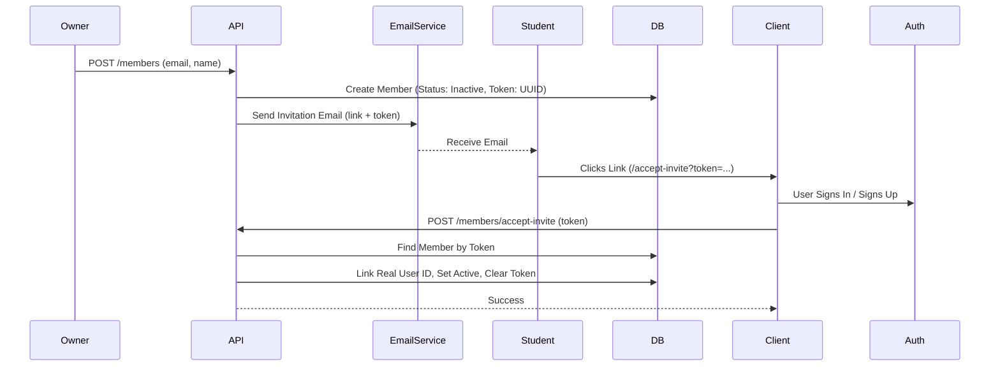
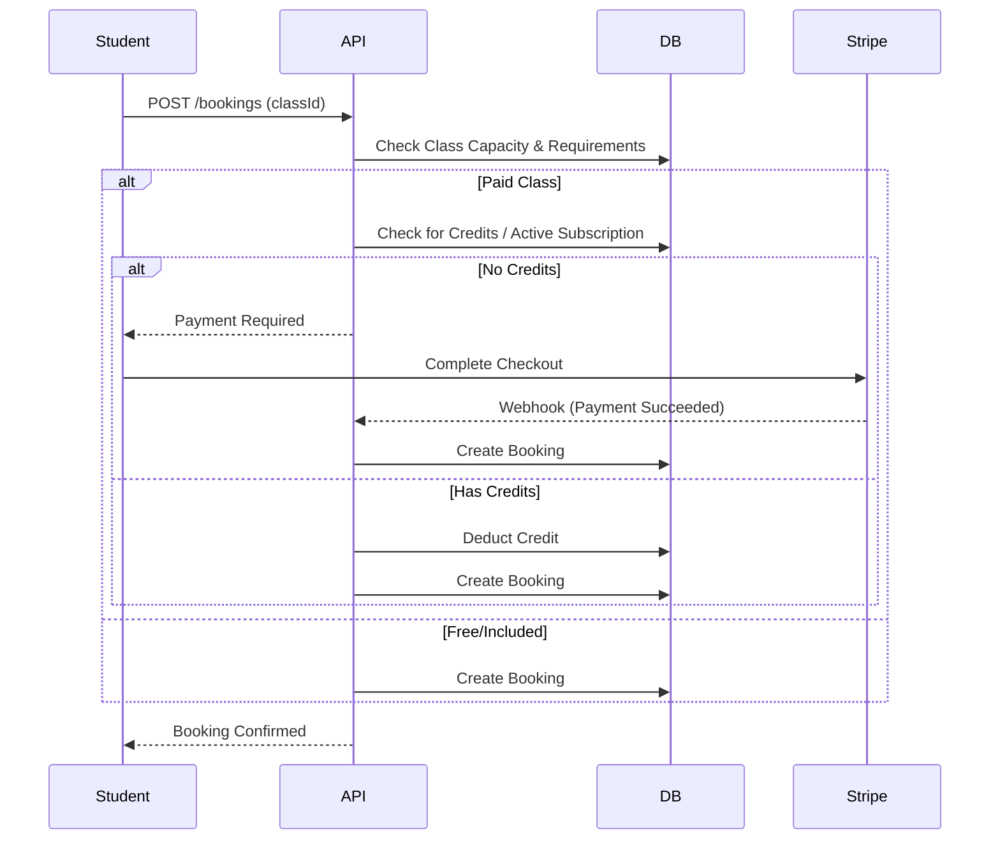
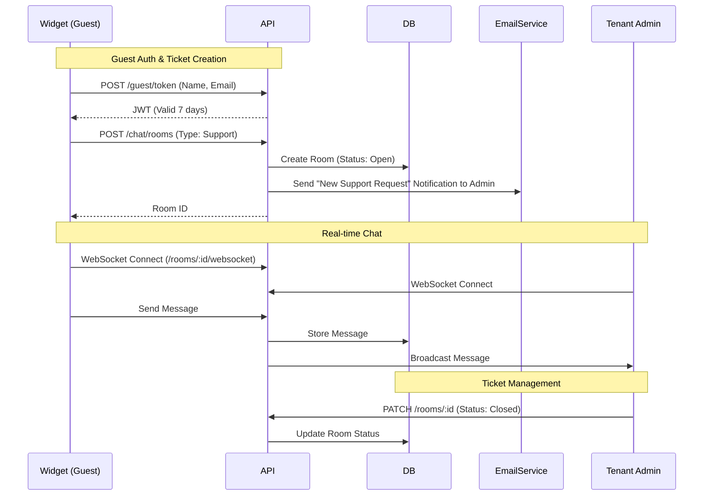
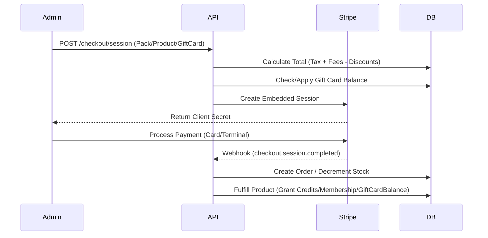
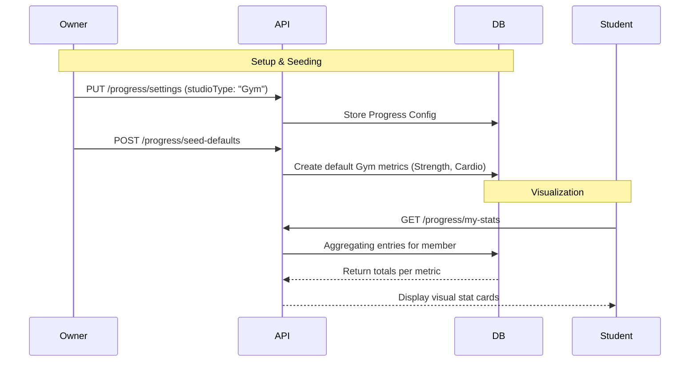

# System Overview

## High-Level Architecture

The Studio Platform is a multi-tenant SaaS built on Cloudflare's edge network.

```mermaid
graph TD
    Client[Web Client (React Router v7)]
    Mobile[Platform Mobile App (Expo / React Native)]
    Auth[Clerk Auth / AuthStore]
    
    subgraph "Cloudflare Edge"
        Pages[Cloudflare Pages (Web)]
        Worker[Cloudflare Worker (API / Hono)]
        D1[(D1 Database)]
        R2[(R2 Storage)]
    end
    
    subgraph "External Services"
        Stripe[Stripe (Payments/Connect)]
        Resend[Resend (Email)]
        Expo[Expo Push Service]
    end

    Client -->|Auths with| Auth
    Mobile -->|Auths with| Auth
    Client -->|Serves Assets| Pages
    Client -->|API Requests| Worker
    Mobile -->|API Requests| Worker
    
    Worker -->|CRUD| D1
    Worker -->|PDFs/Images| R2
    Worker -->|Process Payments| Stripe
    Worker -->|Send Emails| Resend
    Worker -->|Push Notifications| Expo
```

## Core Workflows

### 0. Automations (Cron Triggers)
The system uses Cloudflare Cron Triggers to handle time-sensitive tasks:

**Schedule: Every 15 minutes** (`*/15 * * * *`)
- **No-Show Marking**: Automatically marks bookings as "No Show" if not checked in after class ends.
- **Low Enrollment Cancellation**: Cancels classes with insufficient students X hours before start.
- **Waitlist Promotion**: (Event-driven & Scheduled) Promotes users when spots open.
- **Scheduled Reports**: Sends daily/weekly/monthly reports to admins.

**Schedule: Daily at 2 AM UTC** (`0 2 * * *`)
- **Database Backup**: Exports entire D1 database to R2 storage with 90-day retention. See [`docs/disaster-recovery.md`](file:///Users/slichti/GitHub/studio-platform-dev/docs/disaster-recovery.md) for recovery procedures.

### 1. Member Invitation & Onboarding
User Roles:
- **Admin**: System Administrators with full platform access (Dashboard + Admin Portal).
- **Owner**: Premium Studio Owners (Customers). Access to Dashboard and VIP features, but NO Admin Portal access.
- **User**: Standard users (Instructors, Students).



### 2. Class Booking



### 3. Conflict Detection
The system prevents double-bookings for rooms and staff members via a centralized `ConflictService`.
- **Instructor Conflicts**: Checked when creating or updating classes, and when claiming substitutions.
- **Room Conflicts**: Checked when scheduling classes or manual appointments to prevent space overlaps.
- **Overridability**: Admins can override conflicts if necessary, but the API returns 409 by default.

### 3. Notifications & Substitute Dispatch
The system checks user preferences before sending alerts.
*   **Trigger**: Sub Request Created or Filled.
*   **Logic**:
    *   Iterate targeted instructors.
    *   Check `tenantMembers.settings.notifications.substitutions`.
    *   If `email=true` -> Resend.
    *   If `sms=true` -> Twilio.
    *   If `push=true` -> Expo.

### 3. Expanded Chat System (Support & Ticketing)



### 5. Retail & POS (Point of Sale) with Gift Cards



### 6. Advanced Payroll Generation
The payroll engine supports both flat/hourly rates and percentage-of-revenue payouts.
- **Gross vs Net**: Tenants can configure whether percentages are calculated on gross revenue or net (after estimated transaction fees).
- **Credit Value Calculation**: For students using class packs, the revenue for that booking is calculated by prorating the pack's purchase price over its total credits.
- **Refund Reconciliation**: Webhooks automatically reverse class credits and disable gift cards if the associated Stripe transaction is refunded.

### 7. Advanced Progress Tracking
The system allows studios to track member performance and attendance milestones based on their business focus.
- **Studio Types**: Owners select a business model (Yoga, Gym, Hybrid) which seeds relevant default metrics.
- **Metric Visibility**: Admins can toggle whether specific metrics (e.g., "Weight Lifted") are visible to students.
- **Aggregation**: Data is automatically aggregated using functions like `SUM`, `MAX`, or `AVG` to provide meaningful stats.



### 8. Learning Management System (LMS)
The platform includes built-in course building and delivery capabilities. Instructors can construct rich curricula mixing various content types, while students track their progress through a dedicated portal.
- **Content Types**: Supports Videos, Quizzes, Articles (rich-text reading panes), and Assignments.
- **Interactive Features**: Students can submit assignments (text/files) and participate in threaded discussions on individual lessons via the Comments system.
- **Assessments**: Automatically tracks course progress and generates completion certificates upon reaching 100%.

### 9. Multi-Tenant Edge SEO
The platform implements dynamic local SEO management directly at the Cloudflare edge to provide high-performance organic acquisition funnels.
- **Dynamic Meta Injection**: An `HTMLRewriter` middleware intercepts all studio page requests, injecting tailored `<title>`, `<meta>` descriptions, and Schema.org rich results (e.g. `YogaStudio`, `VideoObject`) fetched directly from D1, bypassing origin server rendering constraints.
- **Streaming Sitemaps**: The global `/sitemap.xml` route generates infinite-scale sitemaps by utilizing D1 cursors and Cloudflare's `TransformStream` to stream all tenant routes without hitting memory limits.

## Security Implementation

### Authentication Strategy
*   **Provider**: Clerk (Primary)
*   **Custom UI**: `CustomSignIn` / `CustomSignUp` components (using Clerk Hooks) for full brand control and accessibility.
*   **Bypass**: `__e2e_bypass_user_id` mechanism for CI/Testing, strictly gated to `DEV/TEST` environments.
*   **Impersonation**: Admin-to-Tenant impersonation via secure `HS256` tokens.

### Role-Based Access Control (RBAC)
*   **Platform Admin**: Global system access. Validated via `users.isPlatformAdmin`.
*   **Studio Owner**: Full access to tenant data and settings. Validated via `tenantRoles`.
*   **Instructor**: Limited management of classes, members, and bookings.
*   **Student**: Restricted to own profile, bookings, and public data.

### Performance & Scalability
The platform is designed for high-concurrency edge execution:
*   **Intelligent Batching**: Multi-query operations (like Quota checks) are batched via `D1.batch()` to minimize round-trip latency.
*   **Database Indexing**: Performance-critical paths (activity tracking, scheduling) use specific indices on `startTime`, `checkedInAt`, and `memberId`.
*   **Efficient Automations**: Mass-processing tasks (win-back automations) use aggregated lookups to avoid N+1 query patterns.
*   **Perceived UX**: Integrated `SkeletonLoader` across all core routes to eliminate layout shift during data fetching.
*   **Infinite Scrolling**: Class schedules and audit logs use chunked fetching to maintain sub-100ms interaction times regardless of data volume.
