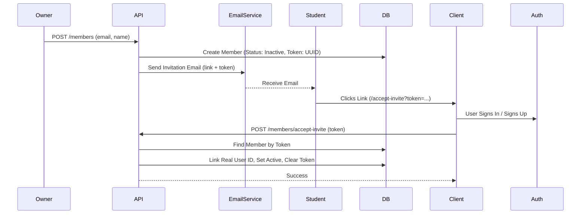
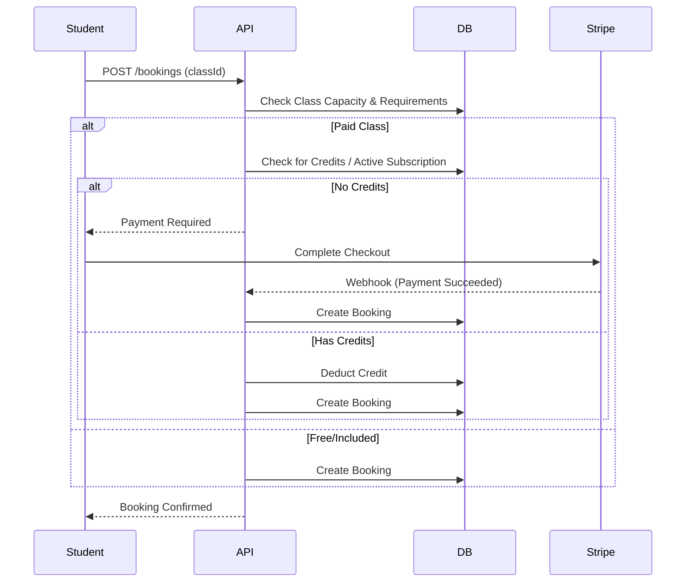

# System Overview

## High-Level Architecture

The Studio Platform is a multi-tenant SaaS built on Cloudflare's edge network.

```mermaid
graph TD
    Client[Web Client (React Router v7)]
    Auth[Clerk Auth]
    
    subgraph "Cloudflare Edge"
        Pages[Cloudflare Pages (Web)]
        Worker[Cloudflare Worker (API / Hono)]
        D1[(D1 Database)]
        R2[(R2 Storage)]
    end
    
    subgraph "External Services"
        Stripe[Stripe (Payments/Connect)]
        Resend[Resend (Email)]
    end

    Client -->|Auths with| Auth
    Client -->|Serves Assets| Pages
    Client -->|API Requests| Worker
    
    Worker -->|CRUD| D1
    Worker -->|PDFs/Images| R2
    Worker -->|Process Payments| Stripe
    Worker -->|Send Emails| Resend
```

## Core Workflows

### 1. Member Invitation & Onboarding



### 2. Class Booking


