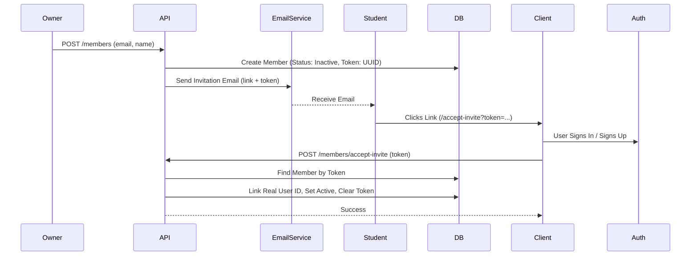
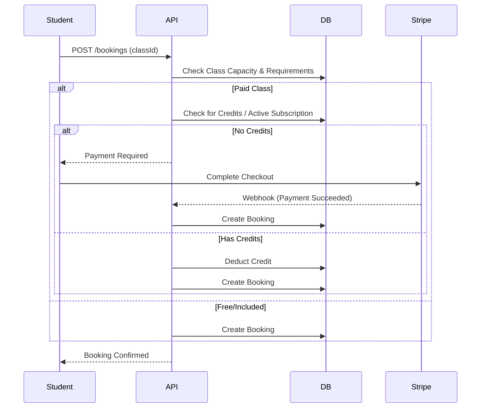
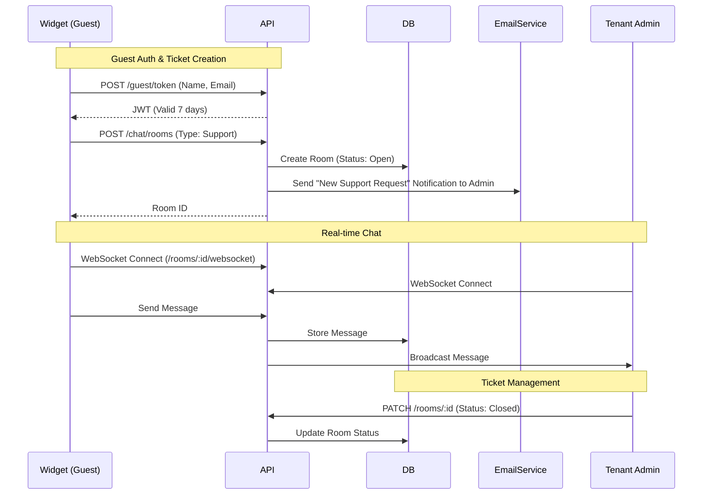
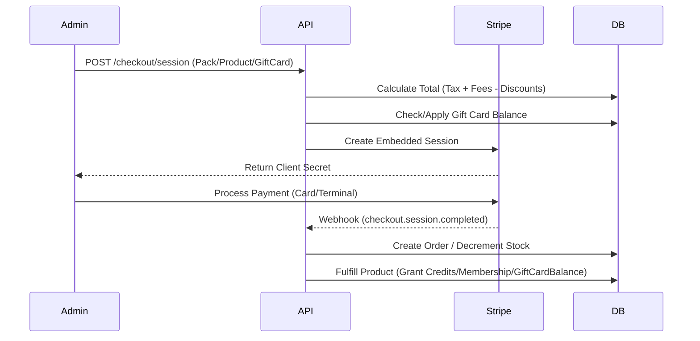

# System Overview

## High-Level Architecture

The Studio Platform is a multi-tenant SaaS built on Cloudflare's edge network.

```mermaid
graph TD
    Client[Web Client (React Router v7)]
    Mobile[Platform Mobile App (Expo / React Native)]
    Auth[Clerk Auth / AuthStore]
    
    subgraph "Cloudflare Edge"
        Pages[Cloudflare Pages (Web)]
        Worker[Cloudflare Worker (API / Hono)]
        D1[(D1 Database)]
        R2[(R2 Storage)]
    end
    
    subgraph "External Services"
        Stripe[Stripe (Payments/Connect)]
        Resend[Resend (Email)]
        Expo[Expo Push Service]
    end

    Client -->|Auths with| Auth
    Mobile -->|Auths with| Auth
    Client -->|Serves Assets| Pages
    Client -->|API Requests| Worker
    Mobile -->|API Requests| Worker
    
    Worker -->|CRUD| D1
    Worker -->|PDFs/Images| R2
    Worker -->|Process Payments| Stripe
    Worker -->|Send Emails| Resend
    Worker -->|Push Notifications| Expo
```

## Core Workflows

### 0. Automations (Cron Triggers)
The system uses Cloudflare Cron Triggers (`*/15 * * * *`) to handle time-sensitive tasks:
- **No-Show Marking**: Automatically marks bookings as "No Show" if not checked in after class ends.
- **Low Enrollment Cancellation**: Cancels classes with insufficient students X hours before start.
- **Waitlist Promotion**: (Event-driven & Scheduled) Promotes users when spots open.
- **Scheduled Reports**: Sends daily/weekly/monthly reports to admins.

### 1. Member Invitation & Onboarding
User Roles:
- **Admin**: System Administrators with full platform access (Dashboard + Admin Portal).
- **Owner**: Premium Studio Owners (Customers). Access to Dashboard and VIP features, but NO Admin Portal access.
- **User**: Standard users (Instructors, Students).



### 2. Class Booking



### 3. Notifications & Substitute Dispatch
The system checks user preferences before sending alerts.
*   **Trigger**: Sub Request Created or Filled.
*   **Logic**:
    *   Iterate targeted instructors.
    *   Check `tenantMembers.settings.notifications.substitutions`.
    *   If `email=true` -> Resend.
    *   If `sms=true` -> Twilio.
    *   If `push=true` -> Expo.

### 3. Expanded Chat System (Support & Ticketing)



### 5. Retail & POS (Point of Sale) with Gift Cards



## Security Implementation

### Authentication Strategy
*   **Provider**: Clerk (Primary)
*   **Custom UI**: `CustomSignIn` / `CustomSignUp` components (using Clerk Hooks) for full brand control and accessibility.
*   **Bypass**: `__e2e_bypass_user_id` mechanism for CI/Testing, strictly gated to `DEV/TEST` environments.
*   **Impersonation**: Admin-to-Tenant impersonation via secure `HS256` tokens.

### Role-Based Access Control (RBAC)
*   **Platform Admin**: Global system access. Validated via `users.isPlatformAdmin`.
*   **Studio Owner**: Full access to tenant data and settings. Validated via `tenantRoles`.
*   **Instructor**: Limited management of classes, members, and bookings.
*   **Student**: Restricted to own profile, bookings, and public data.
