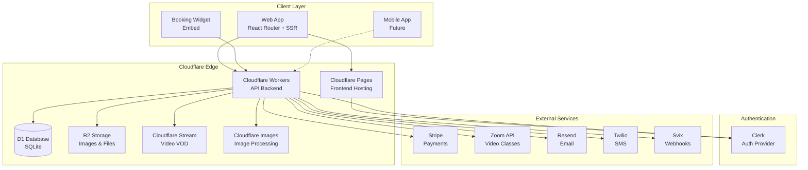
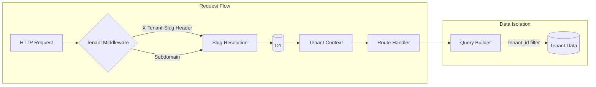
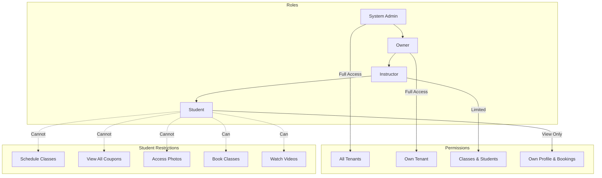
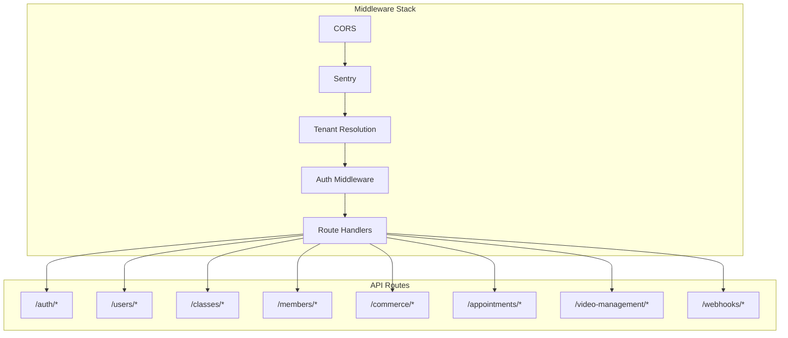

# Studio Platform Architecture

## System Overview

## Multi-Tenant Architecture

## Role-Based Access Control

## API Layer Structure

## Technology Stack

| Layer | Technology |
|-------|------------|
| **Frontend** | React Router v7, TypeScript, TailwindCSS |
| **Backend** | Cloudflare Workers, Hono Framework |
| **Database** | Cloudflare D1 (SQLite), Drizzle ORM |
| **Storage** | Cloudflare R2 (Files), Stream (Video), Images |
| **Auth** | Clerk |
| **Payments** | Stripe Connect (Multi-tenant) |
| **Email** | Resend |
| **SMS** | Twilio |
| **Video Calls** | Zoom API |
