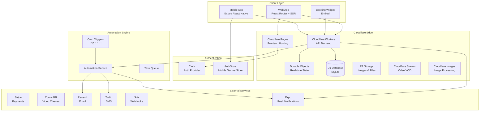
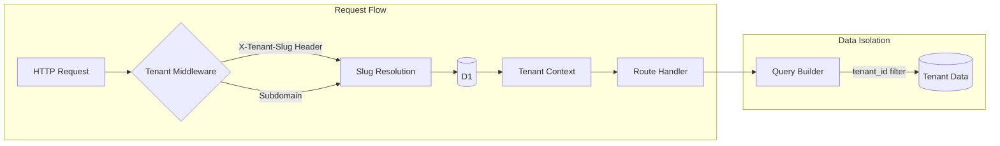
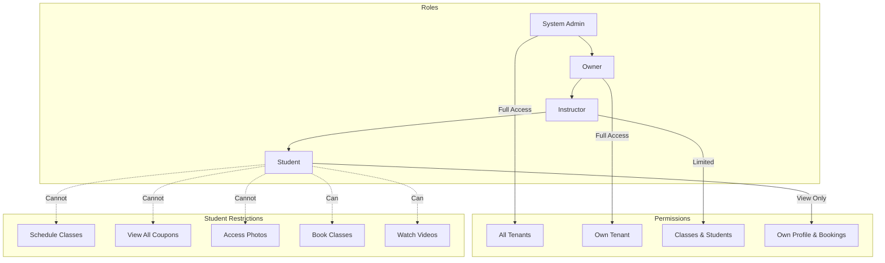
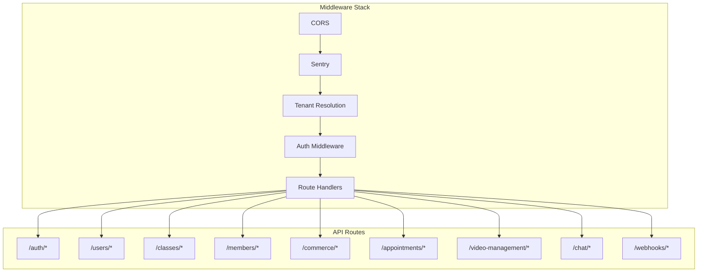
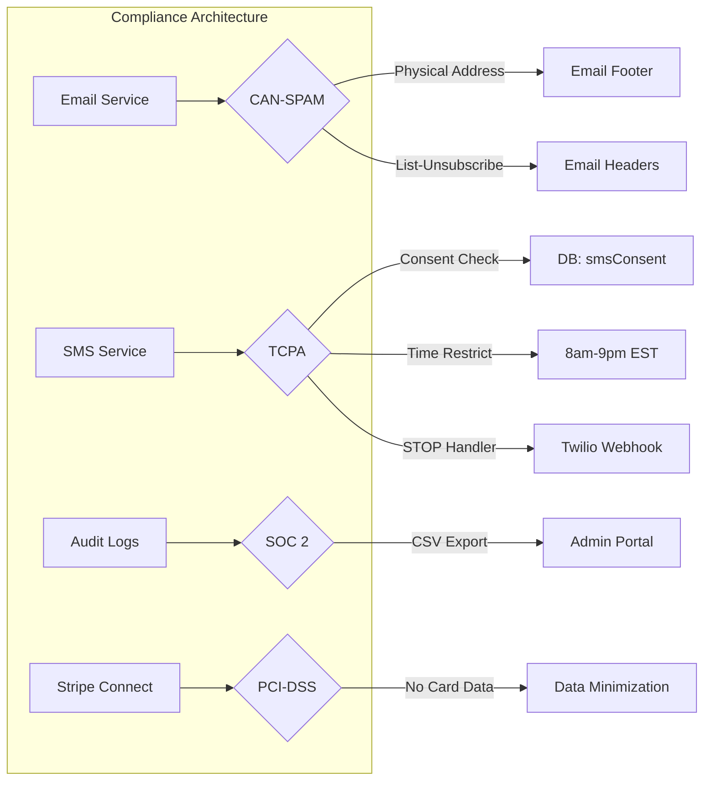

# Studio Platform Architecture

## System Overview

## Multi-Tenant Architecture

## Role-Based Access Control

## Security Implementation

### Role-Based Access Control (RBAC)
*   **Platform Admin**: Global system access. Validated via `users.isPlatformAdmin`.
*   **Studio Owner**: Full access to tenant data and settings. Validated via `tenantRoles`.
*   **Instructor**: Limited management of classes, members, and bookings.
*   **Student**: Restricted to own profile, bookings, and public data.

### Threat Mitigation
*   **IDOR Prevention**:
    *   **Bookings**: Operations like cancellation/modification enforce ownership checks (`booking.memberId === currentMember.id`) or Admin/Owner role.
    *   **Uploads**: Sensitive files (e.g., waivers) are protected by ownership or role checks.
*   **CSRF Protection**:
    *   **Stripe Connect**: Usage of **Signed State Tokens (JWT)** prevents CSRF attacks during the OAuth flow. The `state` parameter is cryptographically verifiable.
*   **Tenant Isolation**:
    *   All queries are scoped by `tenantId` derived from the request hostname/header via strict middleware.

## API Layer Structure

## Technology Stack

| Layer | Technology |
|-------|------------|
| **Frontend** | React Router v7, TypeScript, TailwindCSS |
| **Backend** | Cloudflare Workers, Hono Framework |
| **Database** | Cloudflare D1 (SQLite), Drizzle ORM |
| **Storage** | Cloudflare R2 (Files), Stream (Video), Images |
| **Auth** | Clerk |
| **Payments** | Stripe Connect (Multi-tenant) |
| **Email** | Resend |
| **SMS** | Twilio |
| **Video Calls** | Zoom API |
| **Real-time** | Cloudflare Durable Objects (WebSockets) |

## Compliance & Data Minimization
*   **Financial System of Record**: Stripe is treated as the sole system of record for financial data. The platform does **not** store sensitive cardholder data (PAN, CVV) or bank account numbers.
*   **Stripe Connect Only**: The platform exclusively uses Stripe Standard Connect for tenant payments. "Bring Your Own Key" (Custom Stripe Keys) is not supported to minimize PCI-DSS scope.
*   **Encryption**: All sensitive integration credentials (e.g., Zoom, Resend) are encrypted at rest using AES-GCM-256.

## Regulatory Compliance

### CAN-SPAM Act
Email marketing compliance is enforced through the `EmailService`:
*   **Physical Address**: Configurable via `branding.physicalAddress` in tenant settings
*   **Unsubscribe Link**: Auto-included footer with `settings.unsubscribeUrl`
*   **List-Unsubscribe Header**: RFC 8058 compliant one-click unsubscribe

### TCPA (Telephone Consumer Protection Act)
SMS marketing compliance is enforced through the `SmsService`:
*   **Consent Tracking**: `tenantMembers.smsConsent`, `smsConsentAt`, `smsOptOutAt` fields
*   **Time Restrictions**: SMS blocked outside 8am-9pm recipient local time (EST default)
*   **Opt-Out Handling**: `/webhooks/twilio/sms` processes STOP/UNSUBSCRIBE keywords
*   **Re-subscription**: START keyword handling with user confirmation

### SOC 2 Type II Readiness
*   **Audit Logging**: All administrative actions logged to `auditLogs` table
*   **Log Export**: CSV export available in Admin Portal
*   **Session Tracking**: Login/logout events captured via Clerk webhooks
*   **Retention**: Audit logs retained for 365 days

### Michigan Identity Theft Protection Act
*   **Data Minimization**: No storage of SSN, driver's license, or financial account numbers
*   **Breach Notification**: Incident response workflow supports 45-day notification requirement

### ADA / WCAG 2.1
*   **Semantic HTML**: Proper heading hierarchy, ARIA labels
*   **Keyboard Navigation**: All interactive elements accessible
*   **Color Contrast**: Minimum 4.5:1 ratio for text

