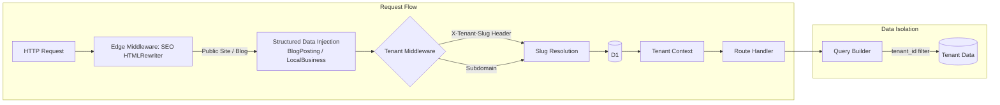
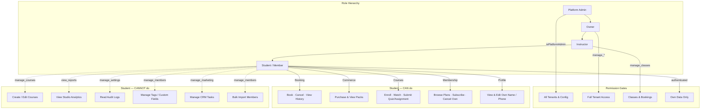
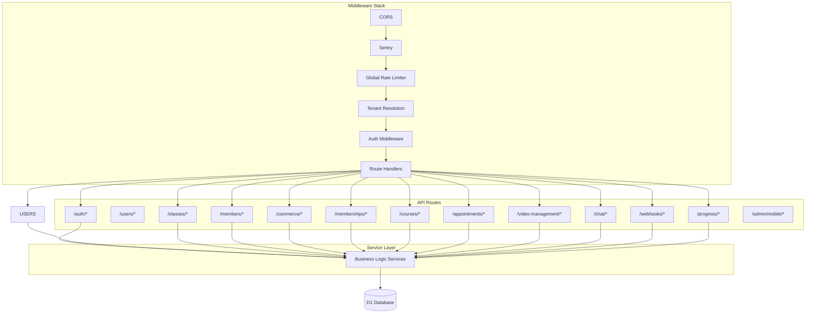
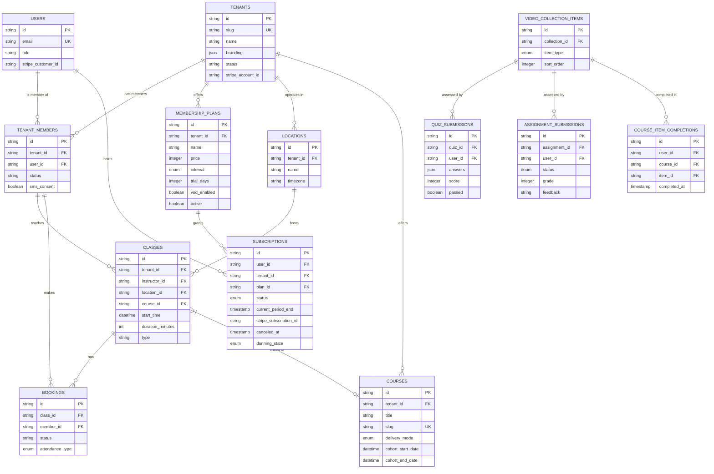
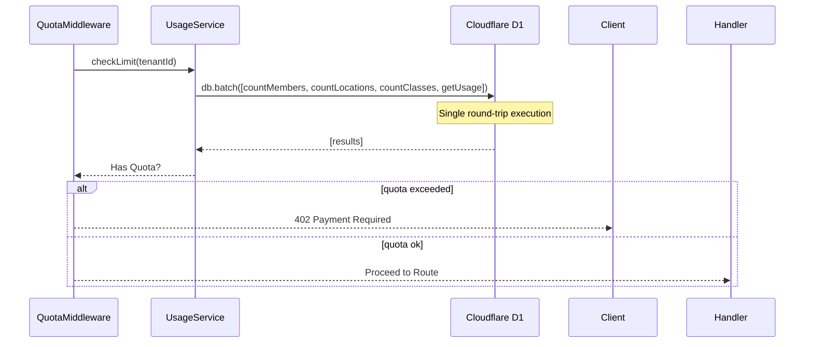
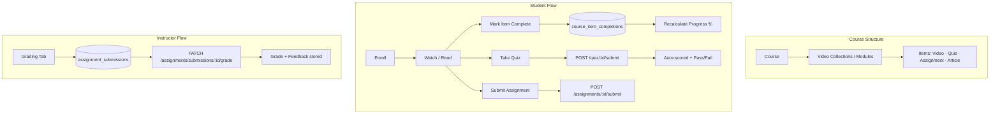
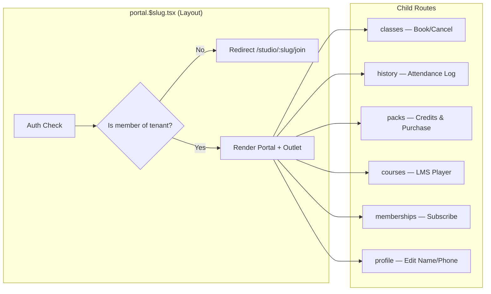
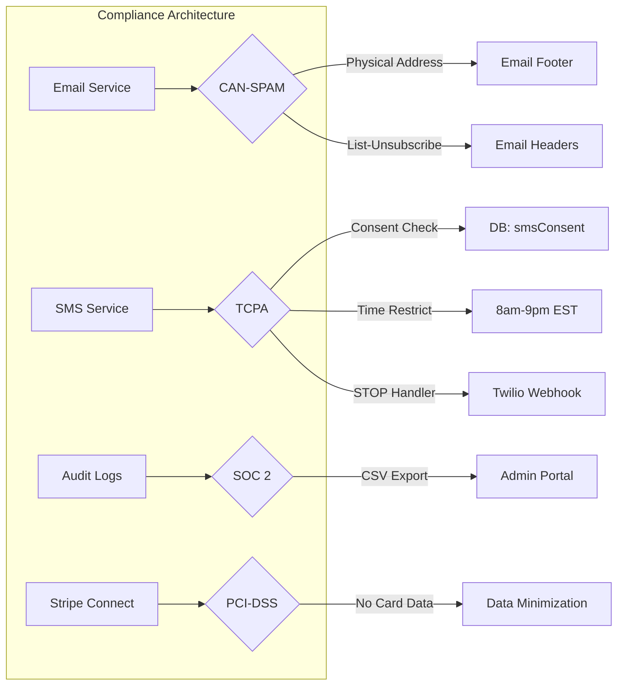

# Studio Platform Architecture

## System Overview

```mermaid
flowchart TB
    subgraph "Client Layer"
        WEB[Web App<br/>React Router + SSR]
        MOBILE[Platform Mobile App<br/>Universal Binary (Expo)]
        WIDGET[Booking Widget<br/>Embed]
    end

    subgraph "Cloudflare Edge"
        PAGES[Cloudflare Pages<br/>Frontend Hosting]
        WORKERS[Cloudflare Workers<br/>API Backend]
        DO[Durable Objects<br/>Real-time State]
        D1[(D1 Database<br/>SQLite)]
        R2[R2 Storage<br/>Images & Files]
        STREAM[Cloudflare Stream<br/>Video VOD]
        IMAGES[Cloudflare Images<br/>Image Processing]
    end

    subgraph "Authentication"
        CLERK[Clerk<br/>Auth Provider]
        STORE[AuthStore<br/>Mobile Secure Store]
    end

    subgraph "External Services"
        STRIPE[Stripe<br/>Payments]
        ZOOM[Zoom API<br/>Video Classes]
        RESEND[Resend<br/>Email]
        TWILIO[Twilio<br/>SMS]
        SVIX[Svix<br/>Webhooks]
        EXPO[Expo<br/>Push Notifications]
        GOOGLE[Google APIs<br/>GBP & Indexing]
    end

    WEB --> PAGES
    WEB --> WORKERS
    WIDGET --> WORKERS
    MOBILE --> WORKERS

    PAGES --> CLERK
    MOBILE --> STORE
    WORKERS --> D1
    WORKERS --> DO
    
    WORKERS --> EXPO
    WORKERS --> GOOGLE
    
    subgraph "Automation Engine"
        AUTO[Automation Service]
        CONTENT[Content Automation Engine<br/>Gemini AI Blogging]
        QUEUE[Task Queue]
        CRON[Cron Triggers<br/>*/15 * * * *]
    end
    
    WORKERS --> AUTO
    CRON --> AUTO
    AUTO --> CONTENT
    CONTENT --> GOOGLE
    AUTO --> RESEND
    AUTO --> TWILIO
    AUTO --> EXPO
    AUTO --> GOOGLE
```

## Multi-Tenant Architecture



## Role-Based Access Control

Permission checks use the `c.get('can')(permission)` helper resolved by `PermissionService` on every authenticated request. Custom roles merge with base permissions before evaluation.



### Permission Guard Reference
| Permission Key | Guarded Routes |
|---|---|
| `manage_courses` | Course CRUD, module/curriculum management, course analytics |
| `manage_classes` | Class scheduling, series management, instructor actions |
| `view_reports` | Analytics (utilization, retention, LTV) |
| `manage_settings` | Tenant settings, audit log access |
| `manage_members` | Tag CRUD, tag assignments, custom field definitions/values, bulk import |
| `manage_marketing` | CRM tasks (create/edit/delete/list-all) |
| `manage_commerce` | Pack definitions, coupon admin |

## Security Implementation

### Role-Based Access Control (RBAC)
*   **Platform Admin**: Global system access. Validated via `users.isPlatformAdmin`.
*   **Studio Owner**: Full access to tenant data and settings. Validated via `tenantRoles`.
*   **Instructor**: Limited management of classes, members, and bookings.
*   **Student**: Restricted to own profile, bookings, and public data.

### Threat Mitigation
*   **IDOR Prevention**:
    *   **Bookings**: Operations like cancellation/modification enforce ownership checks (`booking.memberId === currentMember.id`) or Admin/Owner role. The `GET /bookings/:id` route explicitly validates `class.tenantId` against the active tenant to prevent cross-tenant ID discovery.
    *   **Uploads**: Sensitive files (e.g., waivers) are protected by ownership or role checks.
*   **CSRF Protection**:
    *   **Stripe Connect**: Usage of **Signed State Tokens (JWT)** prevents CSRF attacks during the OAuth flow. The `state` parameter is cryptographically verifiable.
*   **Tenant Isolation**:
    *   All queries are scoped by `tenantId` derived from the request hostname/header via strict middleware.
    *   Lifecycle guards (archived status, subscription status, and the panic switch via `studentAccessDisabled`) run for both authenticated and anonymous requests to ensure public schedules and guest flows cannot bypass a disabled tenant.
    *   **Automations**: Background triggers (e.g., `class_booked`) use explicit joins with the `classes` table to ensure bookings are only processed within the correct tenant scope.
*   **Input Sanitization**:
    *   Stripe customer search queries are sanitized (quotes and backslashes stripped) before interpolation to prevent search syntax injection.
    *   All `dangerouslySetInnerHTML` renders (course articles, assignment instructions, website builder) pass content through `DOMPurify.sanitize()`.
    *   Webhook `gym_id` fields are validated against a strict format regex before any DB lookup.
*   **Safe DB Operations**:
    *   All array-based `DELETE` operations use Drizzle's `inArray()` helper to ensure parameterized, type-safe queries.
*   **CORS**:
    *   `allowHeaders` is restricted to an explicit allowlist: `Authorization`, `Content-Type`, `X-Tenant-Slug`, `X-Request-Id`, `X-Impersonate-User`, and webhook signature headers.
*   **Information Minimization**:
    *   The root `/` health endpoint returns only `{ status: 'OK' }` — no environment variable presence disclosure.

### Platform Configuration
The system uses a global `platform_config` table for system-wide toggles and version management.
*   **Mobile Maintenance Mode**: Globally disables all mobile app connectivity.
*   **Minimum App Version**: Enforces a mandatory update for all users below a specific version string.
*   **Feature Gates**: Enables/disables experimental or paid features (e.g., Webhooks) across all tenants.
### Platform Scalability & Protection
*   **Dynamic Rate Limiting**:
    *   **Cost-Based**: Weighted requests (1 point for GET, 10 points for bulk/export) ensure fair resource usage.
    *   **Global & Granular**:
        *   Global: 300 req/min/IP.
        *   Authenticated: 600 req/min/User.
        *   Isolated Buckets: Public routes (onboarding, booking) have separate counters to prevent DoS.

## API Layer Structure



## Technology Stack

| Layer | Technology |
|-------|------------|
| **Frontend** | React Router v7, TypeScript, TailwindCSS |
| **Backend** | Cloudflare Workers, Hono Framework |
| **Database** | Cloudflare D1 (SQLite), Drizzle ORM |
| **Storage** | Cloudflare R2 (Files), Stream (Video), Images |
| **Auth** | Clerk |
| **Payments** | Stripe Connect (Multi-tenant) |
| **Email** | Resend |
| **SMS** | Twilio |
| **Video Calls** | Zoom API |
| **Real-time** | Cloudflare Durable Objects (WebSockets) |

## Database Schema (3NF)

The platform uses a normalized multi-tenant relational schema. Data isolation is enforced at the application layer using `tenant_id` filters on every query. Full schema with all tables: see [`docs/schema_diagram.md`](./schema_diagram.md).



## Performance & Optimization

### Database Efficiency & Scalability
To maintain low latency on the edge, the API employs several database optimization strategies. All version references below reflect the current pinned API version (`2026-01-28.clover`).



*   **Query Batching**: High-frequency checks (like Tenant Quotas) use `db.batch()` to consolidate multiple count/fetch operations into a single round-trip, reducing overhead by up to 80%.
*   **SARGable Queries**: Overlap detection logic in `ConflictService` uses indexed range filters on `startTime` (indexed) to coarsely filter candidates before applying precise complex SQL duration math.
*   **N+1 Elimination**: Background win-back automations use aggregated queries (`MAX`, `GROUP BY`) to fetch activity for all member candidates in a single operation rather than looping over members. Course curriculum enrichment uses 5 parallel batch queries + in-memory lookup maps, replacing per-item sequential queries.
*   **Cursorless Pagination**: List endpoints (e.g., `/classes`) enforce mandatory `limit` and `offset` parameters to prevent performance degradation as tenant schedules grow.
*   **Relation-based Member Loading**: Tenant middleware fetches member + roles in a single Drizzle `with: { roles: true }` relation query instead of 2 sequential queries, reducing per-request overhead.

### Server Bundle Optimization
To adhere to the Cloudflare Worker 1MB bundle size limit, the application employs aggressive code splitting and lazy loading:
*   **Route Lazy Loading**: Major routes (`Settings`, `Admin`, `Marketing`) are wrapped in `React.lazy` and `Suspense`, ensuring they are not bundled into the main server entry point.
*   **Dynamic Imports**: Heavy libraries (e.g., `mermaid`, `recharts`, `livekit-client`) are imported dynamically only when needed on the client side (`ClientOnly` components).
*   **Separation of Concerns**: UI logic is extracted into separate components to facilitate isolation and independent bundling.

### Perceived Performance & UX
*   **Skeleton Loading**: The platform uses a centralized `SkeletonLoader` component to provide consistent visual feedback across the Dashboard, Analytics, and Student Portal during initial data hydration.
*   **Pagination & Infinite Scroll**: To handle large datasets (e.g., hundreds of scheduled classes), list views implement `useInfiniteQuery` (Admin) or custom `useFetcher` patterns (Portal) to load data in chunks, significantly reducing initial payload size and Time-to-Interactive (TTI).

### Mobile Optimization
*   **Universal App**: Single binary architecture reduces build complexity and store review times.
*   **Over-the-Air Updates**: Uses Expo Updates (where compliant) for rapid critical bug fixes.

## Mobile App Strategy (Platform Model)
Instead of white-labeled binaries for each tenant, the system uses a **Single Platform App**:
*   **Universal Binary**: One app in App Store / Play Store.
*   **Studio Code**: Users enter a unique `slug` (or scan QR) to "bind" the app to a specific tenant.
*   **Theming**: The app dynamically fetches `mobile-config` (primary color, features) to rebrand itself on the fly.
*   **Administration**: Platform admins control tenant access, force minimum versions, and toggle global maintenance mode via the **Admin Mobile Dashboard**.
*   **Push Notifications**: Tokens are registered to the specific tenant context.

## Memberships & Subscriptions

The membership system follows a self-service model aligned with industry best practices (Glofox/Mindbody benchmarks). Plans are created by studio owners and discovered by students via the portal.

```mermaid
flowchart LR
    subgraph "Admin (Studio)"
        CREATE[Create / Edit Plan] --> PLAN[(membership_plans)]
        ARCHIVE[Archive Plan] --> PLAN
    end

    subgraph "Student (Portal)"
        BROWSE[Browse /portal/:slug/memberships] --> PLAN
        JOIN[Join Now] --> CHECKOUT[/studio/:slug/checkout]
        CHECKOUT --> STRIPE[Stripe Embedded Checkout]
        STRIPE --> SUB[(subscriptions)]
        CANCEL[Cancel Plan] --> API_CANCEL[POST /memberships/subscriptions/:id/cancel]
        API_CANCEL --> STRIPE_CANCEL[Stripe cancel_at_period_end]
        STRIPE_CANCEL --> SUB
    end

    subgraph "Dunning & Retention"
        SUB -->|past_due| DUNNING[Dunning Automation]
        DUNNING --> EMAIL[Resend Email]
        DUNNING --> SMS[Twilio SMS]
    end
```

### Plan Lifecycle
| State | Trigger | Behavior |
|---|---|---|
| `active` | Created or restored | Visible to students, purchasable |
| `archived` | Archived by admin OR DELETE with active subs | Hidden from portal; existing subs unaffected |
| Hard deleted | DELETE with no active subs | Removed from DB |

### Subscription Status Flow
```
incomplete → active → past_due → canceled
                  ↘ trialing → active
```

### Trial Periods
Plans with `trial_days > 0` display "Start Free Trial" in the portal. Stripe handles the trial period via `subscription_data.trial_period_days` during checkout.

---

## Course Management (LMS)



### LMS API Endpoints (Feb 2026)
| Method | Path | Description |
|---|---|---|
| `POST` | `/courses/:id/curriculum/:itemId/complete` | Mark item complete, recalculate progress |
| `GET` | `/courses/:id/my-completions` | Student's completed item IDs |
| `POST` | `/quiz/:id/submit` | Auto-score quiz submission |
| `GET` | `/quiz/:id/my-submission` | Latest quiz result |
| `GET` | `/assignments/:id/my-submission` | Student's latest assignment |
| `GET` | `/assignments/:id/submissions` | All submissions (instructor) |
| `GET` | `/:courseId/all-submissions` | All course assignments (instructor) |
| `PATCH` | `/assignments/submissions/:id/grade` | Grade with score + feedback |

---

## Student Portal

The student-facing portal lives at `/portal/:slug/*` and requires the authenticated user to be an active member of the studio (enforced in `portal.$slug.tsx` loader — non-members are redirected to `/studio/:slug/join`).

### Portal Route Map

| Route | Page | Data Sources |
|---|---|---|
| `/portal/:slug` | Dashboard (achievements, challenges) | `/progress/my-stats` |
| `/portal/:slug/classes` | Class schedule + book/cancel | `GET /classes`, `GET /bookings/my-upcoming` |
| `/portal/:slug/history` | Past attendance, paginated by month | `GET /bookings/history` |
| `/portal/:slug/packs` | Purchased pack credits + buy new | `GET /members/me/packs`, `GET /commerce/packs` |
| `/portal/:slug/courses` | Course catalog + enrollments | `GET /courses`, `GET /courses/:id/my-completions` |
| `/portal/:slug/courses/:courseSlug` | LMS player (video/quiz/assignment) | Course + curriculum endpoints |
| `/portal/:slug/memberships` | Plan browser + active subscription | `GET /memberships/plans`, `GET /memberships/my-active` |
| `/portal/:slug/profile` | Stats, memberships, inline profile edit | `GET /members/me`, `PATCH /users/me` |

### Portal Data Flow



### Publicly Accessible Endpoints (No Auth Required)
These endpoints serve booking widgets and checkout flows embedded in public studio websites:

| Endpoint | Use Case |
|---|---|
| `GET /appointments/services` | Public booking widget — lists bookable services |
| `GET /appointments/availability` | Public booking widget — shows available slots |
| `GET /gift-cards/validate/:code` | Checkout page — validates gift card before payment |
| `GET /memberships/plans` | Public plan browser (filtered to `active` only) |
| `GET /classes` | Public class schedule widget |

---

## Commerce Features
*   **Gift Cards**:
    *   Stored in `gift_cards` table (Partial redemption supported).
    *   Split-tender checkout (Gift Card + Credit Card).
    *   Tracked via `gift_card_transactions`.
*   **Discounts**:
    *   Coupon system (`coupons` table) with usage limits and expiry.
    *   Auto-applied or code-based.
*   **POS**:
    *   Retail interface for in-person sales.
    *   Stripe Terminal integration for card presence.
    *   `stripePaymentIntentId` persisted on `pos_orders` to enable terminal refunds.
    *   Transaction history via `GET /pos/transactions` with per-transaction refund status.
    *   Customer update via `PUT /pos/customers/:id` (Stripe Connect).
    *   Refund-by-PaymentIntent via `POST /pos/refund` (full or partial).
    *   Product price changes create a new Stripe Price object (immutable price pattern).
    *   All POS and Inventory API calls include `X-Tenant-Slug` for tenant resolution.

## Compliance & Data Minimization
*   **Financial System of Record**: Stripe is treated as the sole system of record for financial data. The platform does **not** store sensitive cardholder data (PAN, CVV) or bank account numbers.
*   **Stripe Connect Only**: The platform exclusively uses Stripe Standard Connect for tenant payments. "Bring Your Own Key" (Custom Stripe Keys) is not supported to minimize PCI-DSS scope.
*   **Encryption**: All sensitive integration credentials (e.g., Zoom, Resend) are encrypted at rest using AES-GCM-256.

## Regulatory Compliance

### CAN-SPAM Act
Email marketing compliance is enforced through the `EmailService`:
*   **Physical Address**: Configurable via `branding.physicalAddress` in tenant settings
*   **Unsubscribe Link**: Auto-included footer with `settings.unsubscribeUrl`
*   **List-Unsubscribe Header**: RFC 8058 compliant one-click unsubscribe

### TCPA (Telephone Consumer Protection Act)
SMS marketing compliance is enforced through the `SmsService`:
*   **Consent Tracking**: `tenantMembers.smsConsent`, `smsConsentAt`, `smsOptOutAt` fields
*   **Time Restrictions**: SMS blocked outside 8am-9pm recipient local time (EST default)
*   **Opt-Out Handling**: `/webhooks/twilio/sms` processes STOP/UNSUBSCRIBE keywords
*   **Re-subscription**: START keyword handling with user confirmation

### SOC 2 Type II Readiness
*   **Audit Logging**: All administrative actions logged to `auditLogs` table
*   **Log Export**: CSV export available in Admin Portal
*   **Session Tracking**: Login/logout events captured via Clerk webhooks
*   **Retention**: Audit logs retained for 365 days

### Michigan Identity Theft Protection Act
*   **Data Minimization**: No storage of SSN, driver's license, or financial account numbers
*   **Breach Notification**: Incident response workflow supports 45-day notification requirement

### ADA / WCAG 2.1
*   **Semantic HTML**: Proper heading hierarchy, ARIA labels
*   **Keyboard Navigation**: All interactive elements accessible
*   **Color Contrast**: Minimum 4.5:1 ratio for text



## Tenant Provisioning & Onboarding

### Provisioning Flow
1.  **Slug Validation**: Real-time availability check via `POST /studios/validate-slug`. Enforces regex standards and reserved word blocking.
2.  **Creation**:
    *   `POST /studios`: Creates the `tenant` record.
    *   **Billing Intent**: Captures desired tier (Launch/Growth/Scale) and interval.
    *   **Permissioning**: Creator is automatically assigned `owner` role.
3.  **Onboarding Wizard**:
    *   **Steps**: Template Selection -> Branding -> Location -> Schedule -> Team Invite -> Data Import.
    *   **Templates**: Pre-configured business types (Yoga, Gym, Martial Arts, etc.) set default class types and prices.

