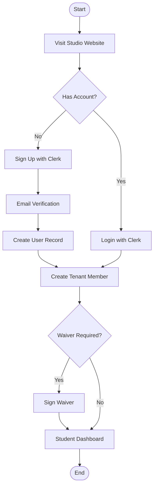
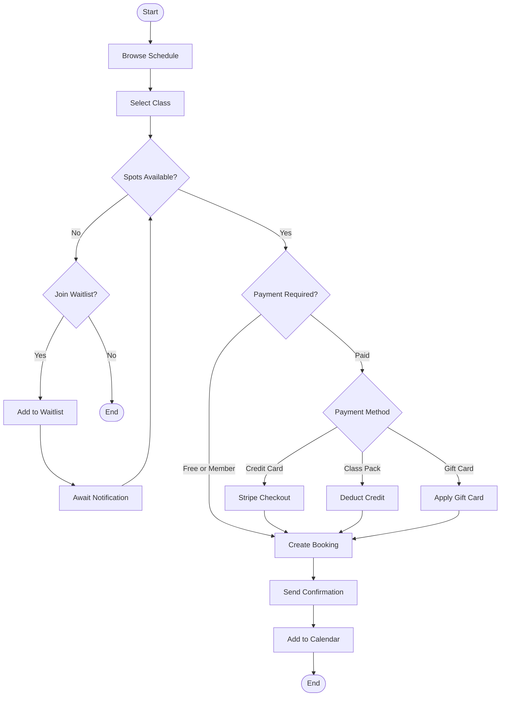
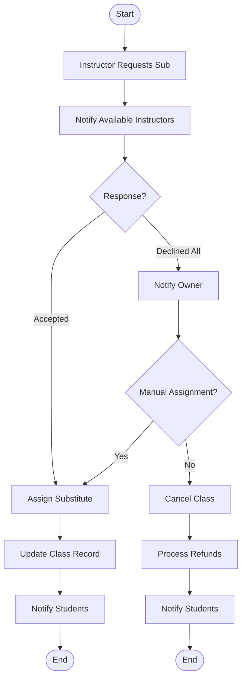
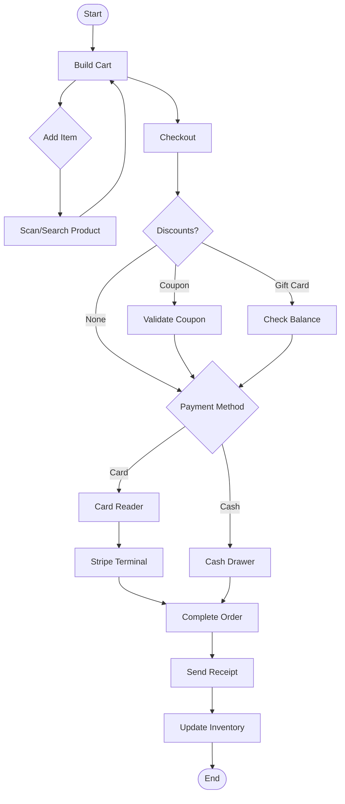
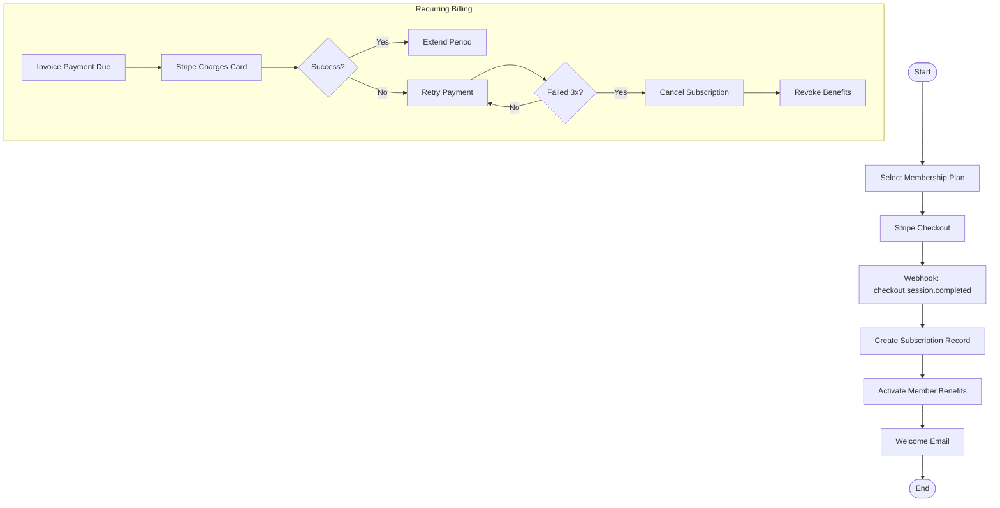
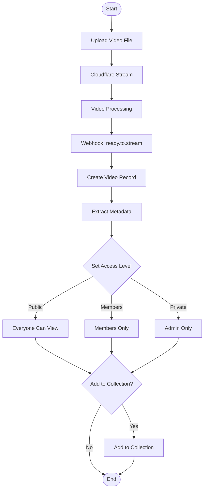
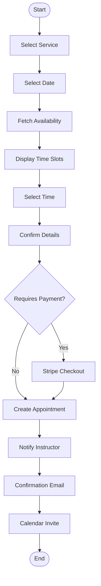

# Business Process Workflows (BPMN)

## Student Registration Flow

## Class Booking Flow

## Instructor Substitution Flow

## POS Transaction Flow

## Membership Subscription Flow

## Video On-Demand Upload Flow

## Appointment Booking Flow

