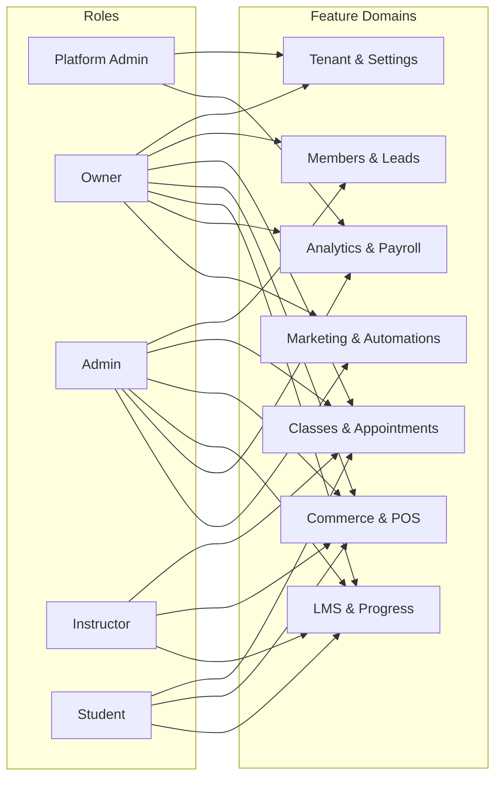

## Studio Platform – Features, Roles, Permissions & RBAC

This document is the high-level map of **what the product can do**, **who can do it**, and **how RBAC is enforced** end-to-end (API, web, and mobile).

---

## 1. Personas & Roles

- **Platform Admin**
  - Operates the SaaS itself (all tenants, billing, backups, plans, feature flags).
  - Represented by `users.isPlatformAdmin === true` and handled outside standard tenant RBAC.
- **Studio Owner**
  - Owns a single studio/tenant. Full control over operations, staff, billing, and settings.
  - Role: `owner` (tenant-level); full `RolePermissions.owner` permission set.
- **Studio Admin / Manager**
  - Day-to-day operations lead (front desk manager, GM).
  - Role: `admin` (tenant-level); broad operational permissions but cannot manage the platform itself.
- **Instructor / Staff**
  - Teaches classes and appointments, manages rosters and limited POS.
  - Role: `instructor`.
- **Student / Member**
  - Books classes, manages own profile/memberships/commerce.
  - Role: `student` (may also have family/child relationships).

Custom roles can be created per tenant using the **Roles** settings UI; custom permissions are merged with base role permissions by `PermissionService.resolvePermissions`.

---

## 2. Permission Keys (API-level capabilities)

Source of truth: `packages/api/src/services/permissions.ts`.

**All permissions (`ALL_PERMISSIONS`)**

- Tenant & Billing
  - `manage_tenant` – Provision/deprovision studio, change slug, high-risk tenant settings.
  - `view_tenant` – Read-only studio profile and configuration.
  - `manage_billing` – Change plans, update payment methods, manage invoices on behalf of tenant.
  - `view_billing` – Read-only access to billing history and plan details.
- Members & CRM
  - `manage_members` – Create/edit/deactivate members; manage tags, custom fields, imports, at‑risk lists.
  - `view_members` – View roster, member profiles, basic metrics.
  - `manage_leads` – Manage lead lists, pipelines, and CRM funnels.
  - `manage_community` – Manage community posts (announcements, events, photos).
- Classes & Appointments
  - `manage_classes` – Create/edit/cancel classes, bulk update/move, waitlists, instructor assignment.
  - `view_classes` – View schedule and class metadata outside public widgets.
  - `check_in_students` – Check-in at kiosk/front desk, mark attendance, no broader class edits.
- Staff & Payroll
  - `manage_staff` – Invite staff, manage roles, impersonation controls.
  - `manage_payroll` – Configure payroll models, generate and commit payouts, view instructor profitability.
- Commerce & POS
  - `manage_pos` – Run POS transactions, refunds, gift card redemptions.
  - `view_pos` – View POS reporting but not mutate inventory/pricing.
  - `manage_inventory` – Create/update products, variants, stock levels.
  - `view_commerce` – Read commerce analytics: orders, revenue, product performance.
  - `manage_commerce` – Create/edit pack definitions, plans, coupons, pricing rules.
- Marketing & Automations
  - `manage_marketing` – Create/edit automations, CRM tasks, campaigns, outbound channels.
- Reports, Progress & Settings
  - `view_reports` – Access analytics dashboards (utilization, retention, LTV, churn, revenue).
  - `manage_reports` – Export reports, schedule reports, advanced configuration.
  - `view_financials` – View sensitive financial metrics (net revenue, margins).
  - `view_progress` – View member progress, course completion, streaks.
  - `manage_progress` – Override completions, mark lessons complete, award manual credits.
  - `view_settings` – Read-only access to tenant-level settings pages.
  - `manage_settings` – Change settings (integrations, webhooks, policies, branding, security).
  - `manage_content` – Manage courses, LMS content, website pages, and CMS blocks.

---

## 3. Built-in Role → Permission Matrix

Source: `RolePermissions` in `packages/api/src/services/permissions.ts`.

| Permission              | Platform Admin | Owner | Admin | Instructor | Student |
|-------------------------|----------------|:-----:|:-----:|:----------:|:-------:|
| `manage_tenant`        | ✅ (all tenants) | ✅   | ❌   | ❌        | ❌      |
| `view_tenant`          | ✅              | ✅   | ✅   | ❌        | ❌      |
| `manage_billing`       | ✅              | ✅   | ❌   | ❌        | ❌      |
| `view_billing`         | ✅              | ✅   | ❌   | ❌        | ❌      |
| `manage_members`       | ✅              | ✅   | ✅   | ❌        | ❌      |
| `view_members`         | ✅              | ✅   | ✅   | ✅        | ❌      |
| `manage_classes`       | ✅              | ✅   | ✅   | ✅        | ❌      |
| `view_classes`         | ✅              | ✅   | ✅   | ✅        | (public / scoped) |
| `manage_staff`         | ✅              | ✅   | ✅   | ❌        | ❌      |
| `view_reports`         | ✅              | ✅   | ✅   | ❌        | ❌      |
| `manage_reports`       | ✅              | ✅   | ✅   | ❌        | ❌      |
| `view_financials`      | ✅              | ✅   | ✅   | ❌        | ❌      |
| `check_in_students`    | ✅              | ✅   | ✅   | ✅        | ❌      |
| `manage_pos`           | ✅              | ✅   | ✅   | ✅        | ❌      |
| `view_pos`             | ✅              | ✅   | ✅   | ✅        | ❌      |
| `manage_inventory`     | ✅              | ✅   | ✅   | ✅        | ❌      |
| `manage_marketing`     | ✅              | ✅   | ✅   | ❌        | ❌      |
| `view_settings`        | ✅              | ✅   | ✅   | ❌        | ❌      |
| `manage_settings`      | ✅              | ✅   | ✅   | ❌        | ❌      |
| `manage_content`       | ✅              | ✅   | ✅   | ✅        | ❌      |
| `manage_leads`         | ✅              | ✅   | ✅   | ❌        | ❌      |
| `manage_community`     | ✅              | ✅   | ✅   | ❌        | ❌      |
| `view_commerce`        | ✅              | ✅   | ✅   | ❌        | ❌      |
| `manage_commerce`      | ✅              | ✅   | ✅   | ❌        | ❌      |
| `view_progress`        | ✅              | ✅   | ✅   | ✅        | (own only) |
| `manage_progress`      | ✅              | ✅   | ✅   | ❌        | ❌      |
| `manage_payroll`       | ✅              | ✅   | ✅   | ❌        | ❌      |

Notes:
- **Platform Admin** is effectively “root” across tenants and can bypass per-tenant RBAC where explicitly coded (e.g., `isPlatformAdmin` short-circuits `can()` checks).
- **Student** capabilities are primarily enforced via **route design + ownership checks**, not via explicit `RolePermissions.student` (see Student Capability Matrix below).

---

## 4. Features & Capabilities by Domain

This section summarizes **what the app actually does** per domain and how permissions map onto those capabilities.

### 4.1 Tenant & Settings

- **Features**
  - Tenant creation, slug management, branding (colors, logos), policies (terms/waivers), integrations (Stripe, Zoom, Mailchimp, Google Calendar).
  - Security: MFA requirement, allowed origins, API keys, webhooks, backups.
- **Key Permissions**
  - `manage_tenant`, `view_tenant`, `manage_settings`, `view_settings`, `manage_billing`, `view_billing`.

### 4.2 Members, Leads, Community

- **Features**
  - Unified roster: create/edit/archive members, search and segment by tags/custom fields.
  - Lead capture and pipeline tracking.
  - Community posts (announcements, events, photos) surfaced in portal dashboard.
- **Key Permissions**
  - `manage_members`, `view_members`, `manage_leads`, `manage_community`.
  - Tags & Custom Fields & Import (IDOR-sensitive): require `manage_members`.

### 4.3 Classes, Appointments & Booking

- **Features**
  - Class series and drop-in scheduling; waitlists; room and instructor conflict detection; bulk move/cancel/update.
  - Appointments with services (duration, price), availability, and booking management.
  - Kiosk mode and check-in workflows; guest booking flows.
- **Key Permissions**
  - `manage_classes`, `view_classes`, `check_in_students`.
  - Bulk operations on `/classes/bulk-*` require `manage_classes`.

### 4.4 Commerce, POS, Inventory

- **Features**
  - Products, packs, memberships, coupons, gift cards; checkout sessions via Stripe Connect.
  - POS terminal for in-studio purchases; inventory tracking and low-stock warnings.
  - Invoices and billing history in the student portal.
- **Key Permissions**
  - `manage_commerce`, `view_commerce`, `manage_pos`, `view_pos`, `manage_inventory`, `view_financials`, `manage_billing`.

### 4.5 LMS, Courses & Progress

- **Features**
  - Courses with modules, lessons, quizzes, assignments, and discussions.
  - Student progress tracking via `courseItemCompletions` and streaks.
  - Instructor tools to grade assignments and override completions.
- **Key Permissions**
  - `manage_content`, `view_progress`, `manage_progress`.

### 4.6 Analytics, Reports & Payroll

- **Features**
  - Analytics: utilization, retention, churn, LTV, revenue, at-risk members.
  - Payroll: flat/hourly/percentage-based pay models on gross/net revenue, fixed deductions, instructor profitability reports, payout generation.
- **Key Permissions**
  - `view_reports`, `manage_reports`, `view_financials`, `manage_payroll`.

### 4.7 Marketing & Automations

- **Features**
  - CRM tasks, marketing campaigns, automations (e.g. win-back, churn prevention).
  - Integrations with Resend, Twilio, Mailchimp, etc.
- **Key Permissions**
  - `manage_marketing`, plus domain-specific permissions like `manage_members` for segmentation.

---

## 5. Student Capability Matrix (End-to-End)

This summarizes **what a logged-in student can do** across web and mobile, enforced via API route design, `c.get('can')`, and ownership checks.

| Domain           | Student CAN                                                                 | Student CANNOT                                                            |
|------------------|------------------------------------------------------------------------------|---------------------------------------------------------------------------|
| Classes          | View schedule, book classes, cancel own bookings, view history              | Create/edit/delete classes, change instructors, run class reports        |
| Packs & Credits  | View own packs and balances; purchase packs via checkout                    | Create/edit pack definitions or discounts                                |
| Memberships      | Browse plans, subscribe, pause/resume/cancel own subscription               | Create/modify/delete membership plans or global pricing                  |
| Courses          | Enroll, watch lessons, submit quizzes/assignments, see own progress         | Create/edit/delete courses and curriculum, view other members’ progress  |
| Profile          | View & edit own basic profile (name, phone, bio, notification prefs)        | Edit other profiles, manage tenant-wide settings                         |
| Commerce History | View own invoices/receipts, download PDFs                                   | View other members’ invoices, global revenue reports                     |
| Notifications    | Opt into/out of email/SMS notifications (where supported)                   | Change global communication policies or defaults                         |
| Analytics        | —                                                                            | Access `/analytics/*` and sensitive financial/ops dashboards             |
| Admin Tools      | —                                                                            | Access audit logs, tags/custom fields admin, imports, CRM task admin     |

Underlying enforcement mechanisms:
- API routes use `c.get('can')(permission)` (via `PermissionService`) for coarse-grained RBAC.
- Many student routes omit explicit `can()` checks but enforce **ownership** before any DB read/write (e.g., `booking.memberId === currentMember.id`).
- Cross-tenant isolation is enforced by requiring that IDs (members, bookings, chat rooms, progress entries) not only match the caller's role but also belong to the current tenant (`tenantId` checks in tenant middleware and route handlers).

---

## 6. RBAC Flow – Visual Representation

The diagram below shows **how roles and permissions are resolved** and used during an API request.

```mermaid
flowchart TD
    subgraph "Request Handling"
        A[Incoming HTTP Request] --> AUTH[Auth Middleware<br/>Clerk JWT]
        AUTH --> TENANT[Tenant Middleware<br/>load tenant + roles]
        TENANT --> PERMS[PermissionService.resolvePermissions<br/>(roles, customRoles)]
        PERMS --> CTX[Context<br/>c.set('can')]
        CTX --> ROUTE[Route Handler]
    end

    subgraph "Role & Permission Model"
        PA[Platform Admin<br/>isPlatformAdmin] --> ALLP[All Permissions (Implicit)]
        OWN[Owner Role] --> RP1[RolePermissions.owner]
        ADM[Admin Role] --> RP2[RolePermissions.admin]
        INST[Instructor Role] --> RP3[RolePermissions.instructor]
        STU[Student Role] --> RP4[RolePermissions.student]

        RP1 --> PERMSET[(Permission Set)]
        RP2 --> PERMSET
        RP3 --> PERMSET
        RP4 --> PERMSET
        CUSTOM[Custom Role Permissions] --> PERMSET
    end

    ROUTE -->|c.get('can')('manage_classes')| DECIDE{Allowed?}
    DECIDE -- Yes --> OK[Proceed with action]
    DECIDE -- No --> FORBID[Return 403 Forbidden]

    style PERMSET fill:#f4f4ff,stroke:#555
    style ROUTE fill:#f0fff4,stroke:#555
    style DECIDE fill:#fffaf0,stroke:#555
```

---

## 7. Feature Map – Visual (High Level)

This diagram shows core **feature domains** and which roles primarily use them.



---

## 8. Where Enforcement Lives in Code

- **API**
  - `packages/api/src/middleware/tenant.ts` – Resolves tenant, roles, custom roles; computes permission set and injects `c.set('can')`.
  - `packages/api/src/services/permissions.ts` – Declares `Permission`, `ALL_PERMISSIONS`, `RolePermissions`, and `PermissionService`.
  - Route files (e.g. `analytics.ts`, `courses.ts`, `tags.ts`, `custom-fields.ts`, `tasks.ts`, `import.ts`, `classes.bulk.ts`) call `c.get('can')('permission_key')` before executing sensitive logic.
- **Web App**
  - Studio routes (e.g. `studio.$slug.*`) use `useOutletContext` to read `roles` and show/hide UI affordances for actions, matching API-level RBAC.
  - Portal routes (e.g. `portal.$slug.*`) assume student role but still rely on API ownership checks.
- **Mobile App**
  - Uses the same API; capabilities are constrained to student/member flows (onboarding, booking, streaks, notifications).

This document should be treated as the **product-level reference** for features, capabilities, and RBAC behavior. For detailed enforcement examples, see `docs/security.md` and `docs/architecture.md`.

